<!--
  REPO SEO (invisible on the rendered README). GitHub builds the repo's search
  listing and social/link-preview card from repository SETTINGS, not from meta
  tags in this file. To control them, set these on the repo:

    About > Description:
      Local-first, privacy-first notes app. Optional per-note cloud sync.
      No trackers, no ads, no AI. Built with Flutter + Supabase.
    About > Website:
      https://devbehindyou.github.io/Project-Atomic-Notes/
    About > Topics:
      flutter, supabase, notes-app, local-first, privacy, offline-first,
      no-tracking, open-source, android, dart, end-to-end-encryption
    Settings > Social preview:
      upload Project-Images/For-README/og-banner.png (1200x630; GitHub accepts it).
-->
<div align="center">
  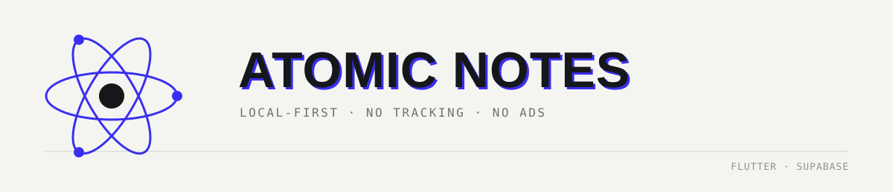

  <p>
    <a href="#get-the-app"></a>
    
    
    <a href="#license"></a>
    
  </p>

  <strong>Local-first notes. Optional cloud sync. No trackers, no ads, no AI. Your notes are never someone's training data.</strong>
</div>

---

## Contents

* [What this is](#what-this-is)
* [Why it exists](#why-it-exists)
* [The problem: your notes became training data](#the-problem-your-notes-became-training-data)
* [Features](#features)
* [App interface](#app-interface)
* [Privacy &amp; Security](#privacy--security)
* [Under the hood](#under-the-hood)
* [Design system](#design-system)
* [Usability](#usability)
* [Get the app](#get-the-app)
* [Roadmap](#roadmap)
* [Tech stack](#tech-stack)
* [License](#license)
* [Author](#author)

---

## What this is

**Atomic Notes** is a note-taking app built on a simple premise. Your notes should work with zero friction, online or offline, and you should never have to guess what happens to your data.

* **Local-first.** Every note is written to on-device storage the instant you stop typing. The local copy is the source of truth, so the app opens at the same speed on 5G or in airplane mode, and launch never blocks on the network.
* **Optional, per-note cloud sync.** Sign in once and notes sync across your devices in realtime. One row per note, not a re-uploaded notebook blob.
* **Notes and checklists, same object.** A checklist is just a note: one data model, one quota, one editor.
* **The promise.** No subscriptions. No AI. No analytics SDKs. No ad SDKs. No third-party trackers. Nothing in the app is built to monetize the contents of your notes.

> **Source availability.** This repository is the public showcase. The full application source is being held back for now, so its security-sensitive parts can be hardened first. Client-side encryption leads that list, and it's [in active development](#roadmap). Opening the source is planned, not shelved. Until then, this README stays exact about what is and isn't protected today.

---

## Why it exists

Atomic Notes has an origin story, and it's the reason it's built the way it is.

The developer used a mainstream notes app the way most people do. Ideas, mostly. Also a few account passwords and private notes he never should have typed there. Then one ordinary day the emails started. *"New sign-in from a location you don't usually use."* One account, then another. What followed was a frantic afternoon of password resets, token revocations, and locked-out services.

The lesson wasn't "switch notes apps." It was:

> **Stop using apps that take your data hostage and use it for their own private, profit-driven ends.**

So Atomic Notes became the app he wished he'd had. Your notes live on *your* device first. The cloud is an option you control. And the business model can never be "mine the contents of your notes."

**The revival.** Atomic Notes was first built roughly three years ago. Back then, feasibility and tooling limits meant it couldn't launch the way it deserved, so it got shelved on purpose, with a note-to-self that one day the tech would catch up. It has. With modern tooling and an AI-assisted rebuild, the project is now **revived**: a new UI/UX system, a re-architected sync engine, a full performance pass, and a security-and-privacy-first foundation.

---

## The problem: your notes became training data

The industry quietly changed the deal. Across mainstream productivity and notes apps, "free" now tends to mean **your content is the product**. It gets read, profiled, and more and more often fed into models as training data. Terms-of-service updates now routinely reserve the right to use what you write to "improve services" and "train AI."

Your notes are the most personal text you produce: half-formed ideas, health details, passwords you shouldn't have put there, drafts you never meant anyone to read. That's not a corpus you should have to donate.

**Atomic Notes is designed to be structurally incapable of that model:**

| Most "free" notes apps | Atomic Notes |
| :--- | :--- |
| Content used to "improve services" and train AI | **No AI in the app. Your notes are never used for training.** |
| Analytics and crash SDKs profiling behavior | **Zero telemetry. No analytics, no crash reporters.** |
| Ad SDKs reading context to target you | **No ad SDKs in the app today.** |
| Cloud-first, so your data lives on their servers by default | **Local-first: your device is the primary copy, cloud is opt-in.** |
| Account required, content monetized to fund "free" | **Funded (planned) by *optional* rewarded ads that buy sync *speed*, never access to your notes.** |

This isn't a posture bolted on afterward. It's *why* the app is local-first, *why* there's no AI, and *why* the funding model (see the [roadmap](#roadmap)) sells convenience, never your content.

---

## Features

* **Notes and checklists, side by side.** Text notes and to-do checklists are first-class objects of the same type. Both count toward the same 50-note free tier and behave identically.
* **Instant local save.** Every keystroke settles into on-device Hive storage. There's no "saving…" spinner, and no way to lose work by closing the app or losing signal.
* **Fully usable offline.** Local storage is the primary copy, not a fallback cache. Launch speed is identical online or off, and startup never waits on the network.
* **Per-note realtime cloud sync.** Sign in once and changes propagate per note across devices, whether created, edited, pinned, or deleted, with conflict handling that won't clobber unsynced edits.
* **Pin, filter, and multi-select.** Pin notes to the top. Filter by Newest, Oldest, To-dos, or Notes. Enter selection mode to bulk-delete.
* **Biometric app lock.** Optional fingerprint or face unlock (`local_auth`) layered *on top of* your account sign-in, gating the app at launch.
* **A "Database" stats screen.** Plain, honest numbers: notes on device vs. notes in cloud, and the last backup time.
* **Server-enforced quota.** The 50-note free tier is enforced in Postgres, not merely hidden in the UI. The client cap is advisory, and the real one is authoritative.

---

## App interface

The UI is the **Technical Editorial** system in practice: ink on paper, interrupted only by a single electric-blue *Signal*. Real screens:

<div align="center">
<table>
  <tr>
    <td align="center" width="33%">
      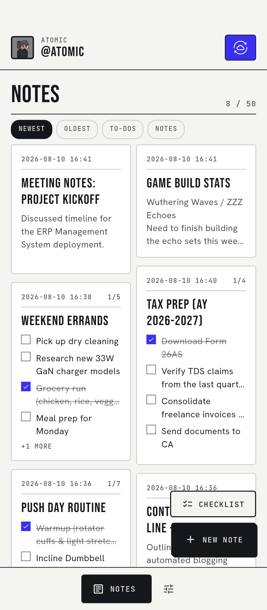<br />
      <sub><b>NOTES, masonry grid</b><br />notes + checklists, filters, quota</sub>
    </td>
    <td align="center" width="33%">
      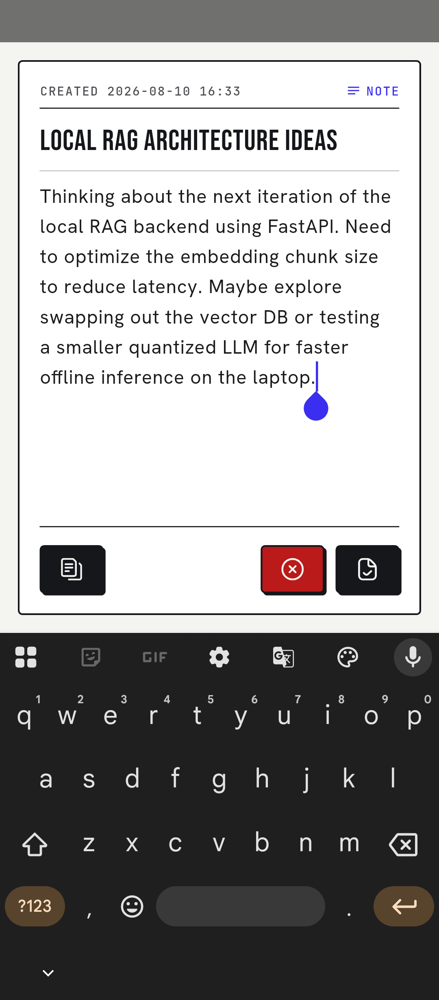<br />
      <sub><b>EDITOR, text note</b><br />distraction-free writing</sub>
    </td>
    <td align="center" width="33%">
      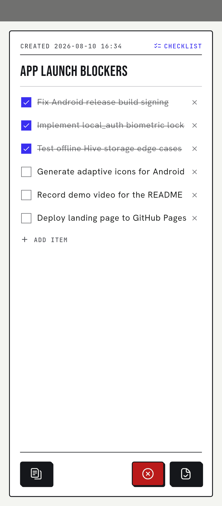<br />
      <sub><b>EDITOR, checklist</b><br />same object, tick items off</sub>
    </td>
  </tr>
  <tr>
    <td align="center" width="33%">
      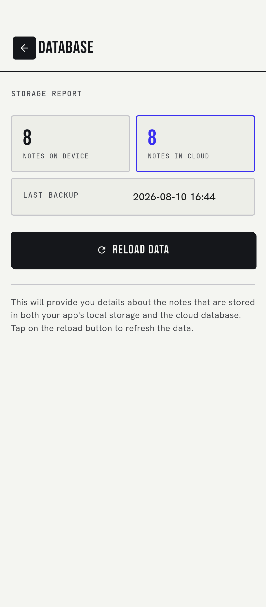<br />
      <sub><b>DATABASE, storage report</b><br />on-device vs. cloud counts</sub>
    </td>
    <td align="center" width="33%">
      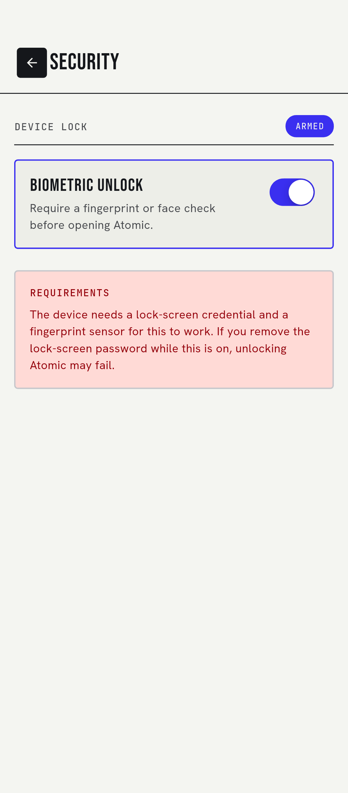<br />
      <sub><b>SECURITY, biometric lock</b><br />opt-in device-level gate</sub>
    </td>
    <td align="center" width="33%">
      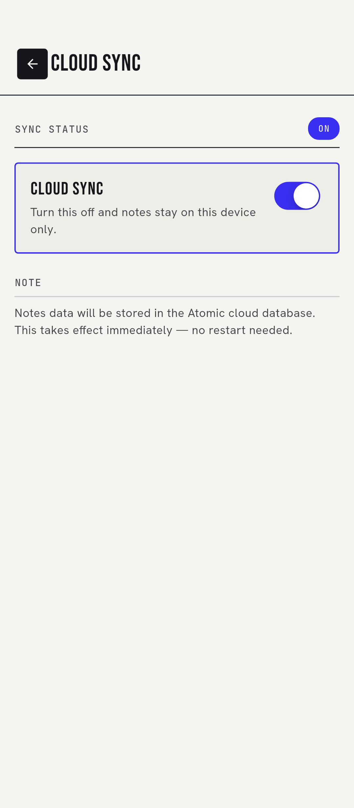<br />
      <sub><b>CLOUD SYNC, your switch</b><br />off = notes stay on device</sub>
    </td>
  </tr>
</table>
</div>

<details>
<summary><b>More screens</b>: settings, selection mode, developer / danger zone</summary>

<div align="center">
<table>
  <tr>
    <td align="center" width="33%">
      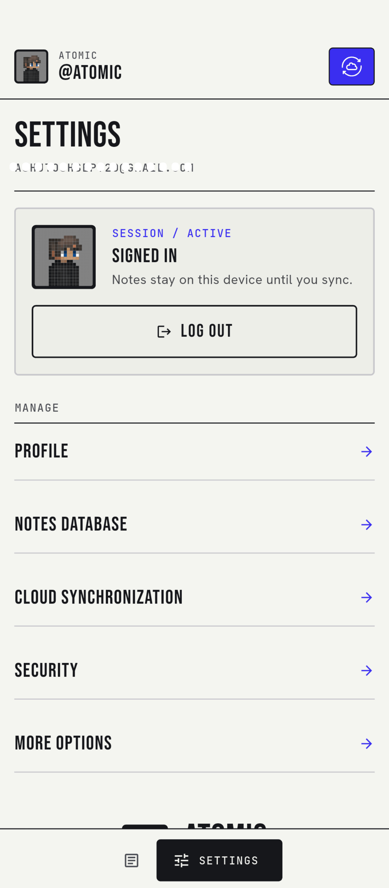<br />
      <sub><b>SETTINGS</b></sub>
    </td>
    <td align="center" width="33%">
      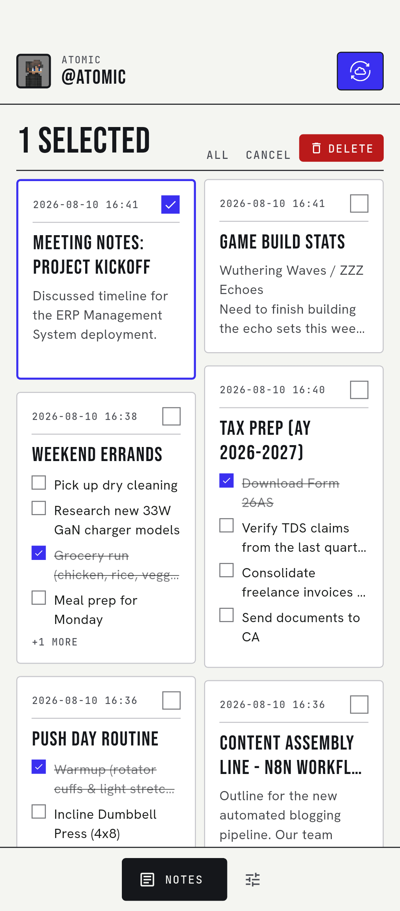<br />
      <sub><b>SELECT &amp; BULK-DELETE</b></sub>
    </td>
    <td align="center" width="33%">
      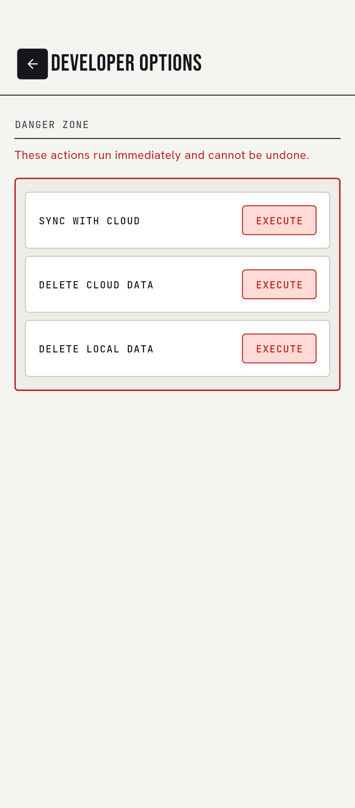<br />
      <sub><b>DANGER ZONE</b> (wipe local/cloud)</sub>
    </td>
  </tr>
</table>
</div>
</details>

---

## Privacy &amp; Security

Precision matters more here than sounding impressive. This section is deliberately exact. For the full, plain-language data-handling disclosure, see [TRANSPARENCY.md](TRANSPARENCY.md).

**What is protected today**

* **In transit:** all backend traffic is over **HTTPS/TLS**.
* **Access control at rest:** cloud data is scoped by **Supabase Row-Level Security (RLS)**. Every table policy is `auth.uid() = user_id`, so your signed-in account is the only one that can read or write your rows.
* **No tracking, full stop:** zero telemetry. No analytics SDK, no crash reporter, no ad SDK, no third-party trackers shipped in the app.
* **No AI:** nothing sends your notes to a model, and none of your content is used for training. The app has no AI feature to send it to.
* **Optional device lock:** biometric unlock can gate the app locally, independent of the account session.

**What is not protected *yet*, stated plainly**

* **Notes are not end-to-end encrypted today.** Note content sits as ordinary text in your account's row. Transport encryption and access control (above) protect it, plus the platform's at-rest disk encryption, but not in a form the operator couldn't read. Access control and cryptography aren't the same thing, and this README won't pretend otherwise.
* **Local storage is not encrypted at rest** on the device today.

> 🔐 **Client-side end-to-end encryption is in active development and targeted for the next release.** It's the top priority, and the prerequisite for opening the source. See [how it's being built](#encryption-in-active-development) below and the [roadmap](#roadmap). Being exact about this now is the point: an app built in reaction to a data breach doesn't get to overclaim security.

---

## Under the hood

A short tour of the parts that make the app trustworthy, and not merely marketed as such.

### Architecture

```
┌──────────────────────────────────────────────┐
│                   UI  (Flutter)               │
│   lib/page/**   +   lib/utility/component/**   │
└───────────────────────┬──────────────────────┘
                        │  listens to
┌───────────────────────▼──────────────────────┐
│   NotesRepository  (single source of truth)   │
│   ChangeNotifier · in-memory index · sync     │
└───────┬───────────────────────────────┬──────┘
        │ instant                        │ optional, per-note
        ▼                                ▼
┌───────────────┐              ┌─────────────────────┐
│  Hive CE       │  ◀ realtime ▶ │  Supabase Postgres  │
│  on-device     │              │  RLS · triggers ·   │
│  (source copy) │              │  realtime           │
└───────────────┘              └─────────────────────┘
```

### Local-first by construction

Boot initializes the backend with a **bounded timeout** and, if it fails, shows a real error screen instead of vanishing:

```dart
// lib/main.dart : startup can time out, but it can never silently die.
await Supabase.initialize(url: cred.PROJECT_URL, publishableKey: cred.API_KEY)
    .timeout(const Duration(seconds: 15));
await Hive.initFlutter();
await NotesRepository.instance.init();   // loads the local copy first
// on failure: runApp(StartupFailedApp(error)). never exit(0)
```

### A sync engine that respects your edits

Sync is **per-note, last-write-wins on a server-authoritative timestamp**, with tombstones for deletes and an offline queue that flushes on reconnect. A background pull can never overwrite a local edit you haven't pushed yet:

```dart
// lib/database/notes_repository.dart : merge, without clobbering unsynced work
if (local.dirty && local.updatedAt.isAfter(remote.updatedAt)) continue;
if (remote.updatedAt.isAfter(local.updatedAt)) {
  _notes[remote.id] = remote;              // remote is newer, take it
  unawaited(_box.put(remote.id, remote.toMap()));
}
```

The `updated_at` used for that comparison is set by **Postgres**, not the client. So a device with a wrong clock can't win a conflict with a bogus future timestamp:

```sql
-- supabase/migrations/002_per_note_realtime.sql
create trigger note_touch_updated_at
  before insert or update on public.note
  for each row execute function public.touch_updated_at();  -- new.updated_at = now()
```

### Limits enforced where they actually count

The 50-note free tier is a client-side hint *and* a server-side rule. Anyone with the anon key could otherwise `curl` in note #51:

```sql
-- supabase/migrations/003_note_limit.sql
if live >= allowance then
  raise exception 'note_limit_reached' using errcode = 'check_violation';
end if;
```

The allowance is stored **per user**, so the (planned) funding system can raise a cap with one `UPDATE` instead of an app release. The groundwork is laid, and honestly labeled as groundwork.

### Encryption (in active development)

The next release closes the one real gap in [Privacy &amp; Security](#privacy--security). The approach being built: derive a key from the user's credentials on-device, then encrypt note content with **AES-256-GCM** *before* it ever leaves the device. The server, and anyone who ever reaches it, then stores only ciphertext.

```dart
// DESIGN: the client-side encryption being built for the next release.
// Notes are sealed on-device. Only ciphertext + nonce are ever synced.
import 'package:cryptography/cryptography.dart';

final algorithm = AesGcm.with256bits();

Future<SecretBox> sealNote(String plaintext, SecretKey key) =>
    algorithm.encrypt(utf8.encode(plaintext), secretKey: key);

// key = Argon2id( passphrase, per-user salt ).  Derived locally, never uploaded.
// server row stores only: { nonce, ciphertext, mac }.  Unreadable server-side.
```

*This snippet is the design under construction, not a claim that encryption ships today.*

---

## Design system

The UI follows a strict system called **Technical Editorial**: condensed uppercase headings, hairline rules instead of shadows, and disciplined restraint on color. The one "shadow" in the whole app is a solid 2px zero-blur offset that mimics offset print.

| Token | Hex | Role |
| :--- | :--- | :--- |
| **Ink** | `#15171B` | Type, borders, inverted blocks |
| **Paper** | `#F4F5F1` | The canvas, a warm off-white |
| **Signal** | `#3A2FF0` | Sync, active states, focus. The *only* accent. |

**Type:** `Bebas Neue` (condensed uppercase headings) · `Hanken Grotesk` (body) · `JetBrains Mono` (metadata, counts, "system status" voice). Fonts are **bundled**, not fetched at runtime. A local-first app has to render correctly with no network.

**Structure:** 8px spacing base · 4px radii (12px only for data chips) · 1.5px hairline strokes · depth from tonal layering, never blur.

---

## Usability

* **One sign-in, then it's yours.** An active session is required once to get past the splash screen. After that the session persists across launches, with no re-login every time.
* **A short walkthrough, once.** New users get a brief onboarding carousel that disappears for good once completed.
* **Lock-screen priority.** If biometric lock is enabled, it takes precedence over everything else at launch, so it can't be accidentally bypassed.
* **Instant everywhere.** Local save and app launch are instant and unconditional, regardless of network, sync state, or plan.

---

## Get the app

* **Android:** prebuilt releases are distributed via the [GitHub Releases](../../releases) page.
* **iOS:** planned. An unsigned iOS build already compiles in CI.
* **Google Play:** no Play Store listing is planned. The one-time Play Console fee is a real barrier for a solo, no-budget project, and GitHub-first distribution fits the open-source direction.
* **Future channels:** an **Amazon Appstore** listing is planned *strictly* to satisfy a future rewarded-ads eligibility requirement (not a primary discovery channel). **F-Droid** may follow as a separate ad-free build flavor.

---

## Roadmap

*This roadmap tracks active development. Items get checked off as they ship to production.*

- [ ] **Client-side encryption. _In active development, shipping next release._** Encrypt note content on-device with a credential-derived key (AES-256-GCM) so notes are unreadable to anyone but the account holder, at rest both in local storage and in the cloud. This is the prerequisite for opening the source.
- [ ] **Publish source code.** Open the repository to public read access (and potentially community contributions) once the encryption and security hardening are integrated.
- [ ] **Amazon Appstore listing &amp; developer verification.**
    - **Verification:** register for Android Developer Verification via the low-friction path to get ahead of Google's expanding requirements for sideloaded apps.
    - **Listing:** publish on the Amazon Appstore. Google AdMob requires an app be listed in a recognized store before it's eligible to serve ads.
- [ ] **The Atomic Coin system (CONCEPT, NOT LIVE):**
    <div align="center">
      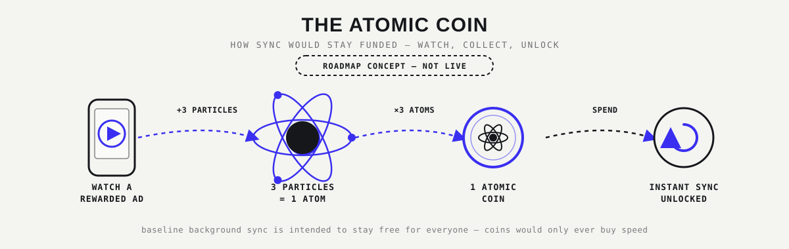
    </div>

    A gamified, opt-in ad economy to fund cloud infrastructure *without* subscriptions:
    - **The mechanic:** watch 1 rewarded ad → 3 particles (1 electron + 1 proton + 1 neutron). 3 particles form 1 **Atom**. 3 Atoms mint 1 **Atomic Coin**.
    - **The utility:** spend 1 Atomic Coin to unlock 1 instant / on-demand cloud sync.
    - **The guarantee:** a free, unmetered periodic background sync stays free for everyone. Coins only ever buy speed and convenience. They never buy the guarantee that a note is saved and synced, and never access to your data.
    - **Anti-fraud:** a server-authoritative coin ledger in Supabase, plus AdMob Server-Side Verification (SSV), so ad completions are verified by the server, not trusted from the client.
- [ ] **Alternative funding channels.** GitHub Sponsors / Ko-fi / Open Collective. A parallel, no-ads-required way to support the project directly.
- [ ] **Task &amp; reminder notifications.** Local notifications for checklists and reminders, once the core sync engine and coin economy are stable.

> **Explicitly *not* on the roadmap:** AI features and paid subscriptions. Both got evaluated in an earlier proposal, then **rejected**. They push the app toward the exact data-hungry, business-first model Atomic Notes exists to avoid.

---

## Tech stack

| Layer | Technology |
| :--- | :--- |
| Client | Flutter (Dart ≥ 3.3) |
| Local storage | Hive CE (`hive_ce` / `hive_ce_flutter`) |
| Backend | Supabase: Postgres + Auth + Row-Level Security + Realtime |
| Auth | Supabase email/password + on-device biometric lock (`local_auth`) |
| Sync | Per-note rows, realtime stream, server-authoritative `updated_at`, tombstones |
| Targets | Android (primary) · iOS · plus Flutter desktop/web scaffolding |

---

## License

**MIT.** See [`LICENSE`](LICENSE). (Takes practical effect once the source is published.)

---

## Author

Built by **DevBehindYou** (Ashutosh Sharma). Web development, SEO, and applied AI.

* Portfolio: [devbehindyou.vercel.app](https://devbehindyou.vercel.app)
* GitHub: [@DevBehindYou](https://github.com/DevBehindYou)
* Medium: [@devbehindyou](https://medium.com/@devbehindyou)
* X: [@devbehindyou](https://x.com/devbehindyou)

<div align="center">
  <sub>Atomic Notes. Local-first · no tracking · no ads · your notes are yours.</sub>
</div>

## Hosted verification

See [CI.md](CI.md) for the standalone Flutter verification workflow and the
separate, optional GitHub Pages showcase setup.
